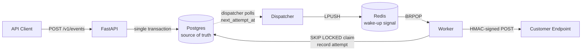

<div align="center">

# Hookdaemon

**Reliable webhook delivery infrastructure. Postgres as the queue, Redis as a signal, retries you can trust.**

[](https://github.com/BlackStarCodes/hookdaemon/actions)
[](https://opensource.org/licenses/MIT)
[](https://www.python.org/downloads/)
[](https://www.docker.com/)

[Quick Start](#quick-start) · [Features](#features) · [Architecture](#architecture) · [Docs](#documentation)

</div>

---

> **Live demo:** _coming Week 8_ · **Blog post:** _coming Week 8_

<!-- TODO: Add demo GIF after Week 8 -->
<!-- <div align="center"></div> -->

## What this is

Hookdaemon is a production-style webhook delivery platform. Applications `POST /v1/events`, Hookdaemon delivers them to tenant-registered endpoints asynchronously, retries failures with exponential backoff and jitter, and exposes complete delivery history, HMAC signing, SSRF protection, and observability.

Built for engineers who want to see how reliable webhook infrastructure actually works under the hood.

## Why it exists

Instead of another CRUD app, Hookdaemon tackles the questions real backend infrastructure must answer:

- How do we avoid losing events if Redis goes down mid-flight?
- How do we retry without hammering a dead server?
- How do we prevent duplicate processing when the client retries?
- How do we recover from a worker crash without dropping in-flight work?
- How do we let tenants debug their own delivery failures?


## Prerequisites

| Dependency | Version | Notes |
|---|---|---|
| Python | 3.11+ | [python.org](https://www.python.org/downloads/) |
| Docker | 24+ | [docker.com](https://docs.docker.com/get-docker/) |
| Docker Compose | v2+ | Included with Docker Desktop |
| Git | Any | [git-scm.com](https://git-scm.com/) |
| [DevDB](https://github.com/BlackStarCodes/devdb) | Latest | Optional — for integration tests |

**Not required:** Postgres and Redis are provisioned by Docker Compose. You do not need them installed on your host.


## Features

| Feature | Description |
|---|---|
| **Idempotent ingestion** | `POST /v1/events` with `Idempotency-Key`. Same key returns the same event. No duplicates. |
| **Async delivery** | Worker process decoupled from the API. Slow endpoints don't block ingestion. |
| **Exponential backoff + jitter** | 8 attempts: 10s, 30s, 2m, 10m, 30m, 1h, 6h, then dead-letter. Full jitter. |
| **Dead-letter queue** | Permanently failed deliveries go to DLQ. Inspect, replay, or fix. |
| **HMAC-SHA256 signing** | Every outbound request signed. Receivers verify authenticity and timestamp freshness. |
| **SSRF protection** | Private ranges, loopback, metadata endpoints, and redirects blocked. DNS pinning. |
| **Per-tenant & per-endpoint rate limiting** | Redis sliding window. 100 req/min/endpoint, 1000 req/min/tenant. |
| **Delivery history** | Every attempt recorded with status code, latency, error type, headers. |
| **Manual replay** | `POST /v1/deliveries/{id}/retry` requeues without blocking the API. |
| **Observability** | Structured JSON logs, Prometheus metrics, worker heartbeat. |

## Architecture



**Postgres is the source of truth. Redis is only a wake-up signal.** If Redis dies, deliveries do not vanish — the dispatcher still finds them by polling Postgres. Workers claim jobs with `SELECT ... FOR UPDATE SKIP LOCKED`, which makes multi-worker safe.

No Celery, Kafka, or Kubernetes. They aren't needed here — Postgres is the queue, Redis is a signal, and the interesting work stays visible.

Full rationale: [`docs/ARCHITECTURE.md`](./docs/ARCHITECTURE.md).

## Quick Start

### 1. Clone and configure

```bash
git clone https://github.com/BlackStarCodes/hookdaemon
cd hookdaemon
cp .env.example .env
```

<details>

<summary>Generate a Fernet key for secret encryption</summary>

Run this and paste the output into `.env` as `SECRET_ENCRYPTION_KEY`:

```bash
python -c "from cryptography.fernet import Fernet; print(Fernet.generate_key().decode())"
```

</details>

### 2. Start the stack

```bash
docker compose up -d
```

| Service | URL |
|---|---|
| API | http://localhost:8000 |
| Swagger | http://localhost:8000/docs |
| Metrics | http://localhost:8000/metrics |

### 3. Bootstrap a tenant

```bash
make bootstrap
```

This creates a tenant, a default API key, and prints the key to stdout.

### 4. Send an event

```bash
curl -X POST http://localhost:8000/v1/events \
  -H "Authorization: Bearer <api_key>" \
  -H "Idempotency-Key: $(uuidgen)" \
  -H "Content-Type: application/json" \
  -d '{
    "event_type": "order.created",
    "payload": {"order_id": 123, "amount": 4999}
  }'
```

### 5. Check delivery status

```bash
curl http://localhost:8000/v1/deliveries \
  -H "Authorization: Bearer <api_key>"
```

## Configuration

All configuration is via environment variables. Copy `.env.example` to `.env` and adjust as needed.

| Variable | Description | Required | Default |
|---|---|---|---|
| `DATABASE_URL` | PostgreSQL connection string | Yes | — |
| `REDIS_URL` | Redis connection string | Yes | — |
| `SECRET_ENCRYPTION_KEY` | Fernet key for encrypting endpoint secrets | Yes | — |
| `LOG_LEVEL` | Logging level (`DEBUG`, `INFO`, `WARNING`) | No | `INFO` |
| `MAX_PAYLOAD_BYTES` | Maximum event payload size | No | `262144` (256 KB) |
| `DELIVERY_TIMEOUT_SECONDS` | HTTP timeout for outbound webhooks | No | `15` |
| `IDEMPOTENCY_TTL_HOURS` | How long idempotency keys are retained | No | `24` |
| `DEFAULT_ENDPOINT_RATE_LIMIT` | Requests per minute per endpoint | No | `100` |
| `DEFAULT_TENANT_RATE_LIMIT` | Requests per minute per tenant | No | `1000` |
| `MAX_ATTEMPTS` | Max delivery retries before dead-letter | No | `8` |

Generate `SECRET_ENCRYPTION_KEY` with:

```bash
python -c "from cryptography.fernet import Fernet; print(Fernet.generate_key().decode())"
```

## Tech stack

| Layer | Choice |
|---|---|
| Language | Python 3.11+ |
| API | FastAPI + Pydantic |
| Database | PostgreSQL + SQLAlchemy (async) + Alembic |
| Queue / cache | Redis (wake-up signal + rate limiting) |
| HTTP client | httpx |
| Logging | structlog (JSON) |
| Metrics | prometheus-client |
| Serving | gunicorn + uvicorn workers |
| Tests | pytest (unit + integration) |
| Test infra | [DevDB](https://github.com/BlackStarCodes/devdb) for ephemeral Postgres |
| Lint / types | ruff + mypy (strict), enforced via pre-commit |
| CI | GitHub Actions |
| Deploy | Fly.io / Oracle Cloud free tier / Hetzner |

## Repository layout

```text
app/            FastAPI app, models, schemas, services, workers
alembic/        Database migrations
tests/          Unit and integration tests
k6/             Load test scripts
scripts/        bootstrap, seeds
docs/           Architecture, decisions, reliability, security
```

Full tree and rules: [`SPEC.md` §15.5](./SPEC.md).

## Documentation

- [`SPEC.md`](./SPEC.md) — full specification
- [`ROADMAP.md`](./ROADMAP.md) — 8-week plan
- [`DECISIONS.md`](./DECISIONS.md) — architecture decision records


## Status

🚧 In active development. See [`ROADMAP.md`](./ROADMAP.md) for current week.

## Related work

- [**DevDB**](https://github.com/BlackStarCodes/devdb) — an OSS CLI for ephemeral PostgreSQL environments, built and maintained by me. Used here to spin up throwaway databases for integration tests.

## License

MIT
