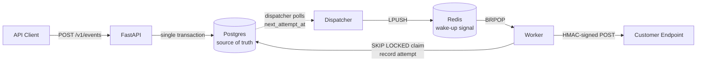

# Webhook Delivery Platform — SPEC.md

## 1. Project Overview
**Name:** `hookdaemon`

A production-style webhook delivery platform that reliably accepts events from applications and delivers them to customer-defined webhook endpoints.

The project focuses on backend engineering and distributed-system concepts:
- asynchronous processing
- background workers
- Redis wake-up signals
- PostgreSQL persistence
- retries and exponential backoff
- idempotency
- rate limiting
- request signing
- delivery tracking
- failure handling
- observability
- Docker and CI/CD
### Pitch
> A reliable webhook delivery service that accepts events, queues them for asynchronous delivery, retries failures automatically, and provides complete delivery history and observability.

---
## 2. Why This Project

Instead of building another CRUD application, this project demonstrates problems that real backend infrastructure must solve.

The important engineering questions are:
- How do we avoid losing events?
- What happens when the destination is unavailable?
- How do we retry safely?
- How do we prevent duplicate processing?
- How do we control delivery rate?
- How do we track every delivery attempt?
- How do we recover from worker failures?

---
## 3. Core Architecture



**Postgres is the source of truth, not Redis.** Redis is only a wake-up signal. If Redis dies, deliveries must not vanish.

- Redis is optional for correctness. If Redis is down, the dispatcher still finds work by polling Postgres.
- Worker claim uses `SELECT ... FOR UPDATE SKIP LOCKED`. This makes multi-worker safe.

---
## 4. MVP
### 4.1 Endpoint Management

Users register endpoints to receive events.
```http
POST   /v1/endpoints
GET    /v1/endpoints
GET    /v1/endpoints/{id}
PATCH  /v1/endpoints/{id}
DELETE /v1/endpoints/{id}
```

Request body:
```json
{
  "url": "https://example.com/webhooks",
  "description": "Order events"
}
```

All `/v1/*` routes require:
```http
Authorization: Bearer <api_key>
```

### 4.2 Event Creation
```http
POST /v1/events
Idempotency-Key: <unique_key>
```

Request body:
```json
{
  "event_type": "order.created",
  "payload": {
    "order_id": 123,
    "amount": 4999
  }
}
```

The API must:
1. Validate the request.
2. Persist the event AND the delivery rows in **one transaction**.
3. Best-effort `LPUSH` delivery IDs to Redis (log and continue on failure).
4. Return `202 Accepted` with `event_id`.

---
## 5. Delivery Worker
Worker and dispatcher run as **separate processes** from the API.
### Dispatcher
Runs every 5 seconds. Finds due deliveries and wakes workers via Redis.
```sql
SELECT id FROM deliveries
WHERE status = 'pending' AND next_attempt_at <= now()
ORDER BY next_attempt_at
LIMIT 100
```

For each row: `LPUSH` the delivery ID to Redis.
If Redis is down, log a warning and continue — the next poll will retry.

If multiple dispatchers run, the same `delivery_id` may be LPUSHed twice.
This is harmless: the worker's `SKIP LOCKED` claim ensures only one worker
processes a given delivery.

### Worker

```text

BRPOP delivery_id from Redis
      ↓
SELECT ... FOR UPDATE SKIP LOCKED LIMIT 1
      ↓
Mark status = 'in_progress', locked_at = now(), locked_by = worker_id
      ↓
Send HTTP POST via httpx
      ↓
Record attempt row in delivery_attempts
      ↓
Success?
 ┌────┴────┐
Yes        No
 │          │
status=   retry or
success   dead_letter
```

Each delivery attempt must record:
- attempt number
- timestamp
- HTTP status code
- response time (ms)
- error message + error type
- request and response headers

Graceful shutdown: on `SIGTERM`, stop claiming, finish in-flight requests, exit.

Set `statement_timeout = '5s'` on the claim query to avoid lock contention.

### Worker heartbeat

Each worker writes `worker:<id>:last_seen` to Redis every 10 seconds with a 30s TTL.
A separate monitor (or the API's `/health/ready`) can alert if no worker heartbeat
exists for 60s.

---
## 6. Retry System

Retry transient failures:

```text
500, 502, 503, 504
timeout
connection failure
```


Do NOT retry:
```text
400, 401, 403, 404, 405, 410, 422
(except `408 Request Timeout` and `429 Too Many Requests` — those retry)
```


Retry schedule (8 attempts max):
```text
Attempt 1 → immediate (initial)
Attempt 2 → +10s
Attempt 3 → +30s
Attempt 4 → +2m
Attempt 5 → +10m
Attempt 6 → +30m
Attempt 7 → +1h
Attempt 8 → +6h
then → DEAD_LETTER
```

Use **full jitter**:
```python
delay = random.uniform(0, min(cap, base * 2**attempt))
```

After the final attempt:
```text
delivery.status = 'dead_letter'
```

---
## 7. Idempotency

Clients may retry the same request. The system must not create duplicate events.

Header:
```http
Idempotency-Key: abc123
```

Rules:
- Key is scoped **per tenant**: unique on `(tenant_id, idempotency_key)`.
- Store the **response body hash** along with the event.
- Repeating the same key returns the same event and the same response.

**TTL:** Idempotency keys expire after **24 hours**. A background job (or Postgres `pg_cron`) deletes expired keys every hour. Until then, a duplicate key returns the original event and response.

---
## 8. Webhook Signing
Every outgoing webhook includes a signature.

Headers:
```http
X-Webhook-ID: wh_123
X-Webhook-Timestamp: 1720000000
X-Webhook-Signature: <hex>
X-Webhook-Signature-Version: v1
```

Algorithm:
```text
signature = HMAC_SHA256(secret, timestamp + "." + request_body)
```

Receiver requirements:
- Reject timestamps older than 5 minutes (replay protection).
- Verify the HMAC using the shared secret.
- Use constant-time comparison.

---
## 9. Timeout & SSRF Handling

Timeouts:
```text
connect = 5s
read    = 10s
total   = 15s
```

SSRF protection:
- Resolve DNS, validate, then connect to the resolved IP with the `Host:` header set (DNS pinning).
- Block:
    - `10.0.0.0/8`
    - `172.16.0.0/12`
    - `192.168.0.0/16`
    - `127.0.0.0/8`
    - `169.254.0.0/16` (includes cloud metadata `169.254.169.254`)
    - `::1`, `fc00::/7`, `fe80::/10`
- Block redirects: `follow_redirects=False`.
- Cap response body at 64 KB via httpx streaming.
Timeouts and SSRF blocks become failed attempts and enter the retry system.

---
## 10. Rate Limiting

Defaults:
- **100 requests / minute / endpoint**
- **1000 requests / minute / tenant**

Implementation: Redis sliding window per key.

When the limit is exceeded:
```http
HTTP/1.1 429 Too Many Requests
Retry-After: 30
X-RateLimit-Limit: 100
X-RateLimit-Remaining: 0
X-RateLimit-Reset: 1720000030
```

Limits are configurable per endpoint.

---
## 11. Delivery History
```http
GET /v1/deliveries
GET /v1/deliveries/{id}
```

Response:
```json
{
  "id": "del_01HX...",
  "event_id": "evt_01HX...",
  "endpoint_id": "ep_01HX...",
  "status": "dead_letter",
  "attempt_count": 3,
  "last_status_code": 503,
  "next_retry_at": null,
  "created_at": "2026-08-18T15:30:00Z"
}
```
All IDs use prefixed ULIDs (e.g. `evt_`, `del_`, `ep_`).

---
## 12. Manual Retry

```http
POST /v1/deliveries/{id}/retry
```

Behavior:
- Keep existing `attempt_count` and attempt rows.
- Set `status = 'pending'`, `next_attempt_at = now()`.
- `LPUSH` to Redis (best-effort).
- Return `202 Accepted`.
Do not send the HTTP request inline. Always requeue.

---
## 13. Database Design

Tables:
```text
tenants
api_keys
endpoints
events
deliveries
delivery_attempts
idempotency_keys
```
### tenants
```text
id              UUID PK
name            TEXT
created_at      TIMESTAMPTZ
```
### api_keys
```text
id              UUID PK
tenant_id       UUID FK -> tenants(id)
key_hash        TEXT UNIQUE       -- SHA-256 of the key
name            TEXT
created_at      TIMESTAMPTZ
last_used_at    TIMESTAMPTZ
revoked_at      TIMESTAMPTZ NULL
```
### endpoints
```text
id                UUID PK
tenant_id         UUID FK -> tenants(id)
url               TEXT
secret_encrypted  BYTEA           -- encrypted at rest (Fernet / libsodium)
description       TEXT
status            TEXT            -- 'active' | 'paused'
created_at        TIMESTAMPTZ
updated_at        TIMESTAMPTZ
```
### events
```text
id                  UUID PK
tenant_id           UUID FK -> tenants(id)
event_type          TEXT
payload             JSONB
payload_size_bytes  INT          -- reject if > 262144
created_at          TIMESTAMPTZ
```
### deliveries
```text
id               UUID PK
event_id         UUID FK -> events(id)
endpoint_id      UUID FK -> endpoints(id)
tenant_id        UUID FK -> tenants(id)
status           TEXT            -- 'pending' | 'in_progress' | 'success' | 'dead_letter' | 'cancelled'
attempt_count    INT DEFAULT 0
max_attempts     INT DEFAULT 8
next_attempt_at  TIMESTAMPTZ
last_status_code INT NULL
last_error       TEXT NULL
locked_at        TIMESTAMPTZ NULL
locked_by        TEXT NULL
created_at       TIMESTAMPTZ
updated_at       TIMESTAMPTZ
```
### delivery_attempts
```text
id                UUID PK
tenant_id         UUID FK -> tenants(id)
delivery_id       UUID FK -> deliveries(id)
attempt_number    INT
status_code       INT NULL
response_time_ms  INT
error             TEXT NULL
error_type        TEXT NULL      -- 'timeout' | 'connect' | 'http' | 'dns' | 'ssrf'
request_headers   JSONB
response_headers  JSONB
created_at        TIMESTAMPTZ
```
### idempotency_keys

```text
id               UUID PK
tenant_id        UUID FK -> tenants(id)
idempotency_key  TEXT
event_id         UUID FK -> events(id)
response_hash    TEXT
expires_at       TIMESTAMPTZ      -- created_at + 24h
created_at       TIMESTAMPTZ
UNIQUE (tenant_id, idempotency_key)
```

Indexes:
```sql
CREATE INDEX ON deliveries (status, next_attempt_at)
  WHERE status = 'pending';
CREATE INDEX ON deliveries (tenant_id, created_at DESC);
CREATE INDEX ON delivery_attempts (delivery_id);
CREATE INDEX ON events (tenant_id, created_at DESC);
CREATE INDEX ON idempotency_keys (expires_at);

```


---
## 14. API
All routes are versioned under `/v1/`.

All list endpoints support pagination:
- `?limit=50` (default 50, max 200)
- `?cursor=<opaque>` (returned in response body as `next_cursor`)

All error responses use RFC 7807 (Problem Details):
```json
{
  "type": "https://example.com/errors/validation",
  "title": "Validation failed",
  "status": 422,
  "detail": "event_type must be a string",
  "instance": "/v1/events"
}
```
### Tenants & Keys
```text
POST   /v1/tenants
GET    /v1/tenants/me
POST   /v1/api-keys
GET    /v1/api-keys
DELETE /v1/api-keys/{id}
```
### Endpoints
```text
POST   /v1/endpoints
GET    /v1/endpoints
GET    /v1/endpoints/{id}
PATCH  /v1/endpoints/{id}
DELETE /v1/endpoints/{id}
```
### Events
```text
POST /v1/events
GET  /v1/events
GET  /v1/events/{id}
```
### Deliveries
```text
GET  /v1/deliveries
GET  /v1/deliveries/{id}
POST /v1/deliveries/{id}/retry
```
### System
```text
GET /health/live
GET /health/ready
GET /metrics
```

### Bootstrap

The first tenant is created via a one-time CLI command:
`make bootstrap`

This creates a tenant, a default API key, and prints the key to stdout.
After the first tenant exists, `POST /v1/tenants` requires an existing admin key.

---
## 15. Technology Stack
```text
Python 3.11+
FastAPI
pydantic-settings
SQLAlchemy (async)
asyncpg
Alembic
PostgreSQL
Redis
httpx
structlog                    (JSON logs)
prometheus-client            (metrics)
Docker + Docker Compose
pytest
ruff                         (lint)
mypy                         (strict type checking)
pre-commit                   (git hooks: ruff, mypy, hygiene checks)
GitHub Actions
k6                           (load test)
gunicorn + uvicorn workers   (production serving)
opentelemetry                (optional, tracing)
```

Worker: a simple Redis-backed worker. No Celery, no Kafka, no Kubernetes unless the project actually needs them.
No React dashboard until all backend work is done.

### Connection pool
- `pool_size = 10`
- `max_overflow = 20`
- `pool_pre_ping = True`
### Production serving
gunicorn -k uvicorn.workers.UvicornWorker -w 2 app.main:app
### Migrations
Run `alembic upgrade head` as a separate deploy step. Do not run on API startup.


---
## 15.5 Project Structure

```
hookdaemon/
├── app/
│   ├── __init__.py
│   ├── main.py                      # FastAPI app factory + startup/shutdown
│   ├── config.py                    # pydantic-settings Settings class
│   ├── db.py                        # async engine, session factory, get_session dep
│   ├── models/
│   │   ├── __init__.py              # import all models so Alembic sees them
│   │   ├── base.py                  # DeclarativeBase + shared mixins
│   │   ├── tenant.py
│   │   ├── api_key.py
│   │   ├── endpoint.py
│   │   ├── event.py
│   │   ├── delivery.py
│   │   ├── delivery_attempt.py
│   │   └── idempotency_key.py
│   ├── schemas/
│   │   ├── __init__.py
│   │   ├── tenant.py
│   │   ├── api_key.py
│   │   ├── endpoint.py
│   │   ├── event.py
│   │   ├── delivery.py
│   │   └── common.py                # Pagination, ProblemDetail, ErrorResponse
│   ├── api/
│   │   ├── __init__.py
│   │   ├── deps.py                  # auth dependency, db dependency, tenant ctx
│   │   └── v1/
│   │       ├── __init__.py
│   │       ├── router.py            # aggregates all v1 routers
│   │       ├── tenants.py
│   │       ├── api_keys.py
│   │       ├── endpoints.py
│   │       ├── events.py
│   │       ├── deliveries.py
│   │       └── health.py
│   ├── services/
│   │   ├── __init__.py
│   │   ├── ingest.py                # event ingestion + idempotency
│   │   ├── delivery.py              # delivery state transitions
│   │   ├── signing.py               # HMAC sign
│   │   ├── rate_limit.py            # Redis sliding window
│   │   └── ssrf.py                  # URL validation + DNS pinning
│   ├── workers/
│   │   ├── __init__.py
│   │   ├── dispatcher.py            # poll Postgres → LPUSH Redis
│   │   ├── worker.py                # BLPOP Redis → SKIP LOCKED → HTTP POST
│   │   ├── retry.py                 # backoff schedule + jitter
│   │   └── heartbeat.py             # worker heartbeat to Redis
│   └── core/
│       ├── __init__.py
│       ├── logging.py               # structlog config + request_id middleware
│       ├── metrics.py               # prometheus-client registry + counters
│       └── security.py              # Fernet encrypt/decrypt for endpoint secrets
├── alembic/
│   ├── env.py
│   ├── script.py.mako
│   └── versions/
│       └── 0001_initial.py          # autogenerated
├── tests/
│   ├── __init__.py
│   ├── conftest.py                  # pytest fixtures: DevDB, redis, client
│   ├── unit/
│   │   ├── test_retry.py
│   │   ├── test_signing.py
│   │   ├── test_ssrf.py
│   │   └── test_rate_limit.py
│   └── integration/
│       ├── test_events.py
│       ├── test_deliveries.py
│       ├── test_worker.py
│       ├── test_retry_flow.py
│       └── test_dlq_replay.py
├── k6/
│   ├── ingest.js                    # POST /v1/events load test
│   └── delivery.js                  # end-to-end delivery load test
├── scripts/
│   ├── bootstrap.py                 # make bootstrap → creates first tenant + key
│   └── seed.py                      # optional, for local demos
├── .github/
│   └── workflows/
│       └── ci.yml                   # ruff → mypy → unit → integration → docker build
├── .pre-commit-config.yaml          # git hooks: ruff, mypy, hygiene
├── .python-version                  # Python version pinned by uv
├── uv.lock                          # resolved dependency lockfile
├── .env.example
├── .gitignore
├── .dockerignore
├── Dockerfile                       # API image
├── Dockerfile.worker                # worker + dispatcher image (same base, different CMD)
├── docker-compose.yml
├── docker-compose.test.yml          # optional: for integration tests
├── Makefile
├── pyproject.toml                   # deps, ruff, mypy, pytest config
├── README.md
```
**Rules for this structure:**

- **One model per file.** Don't put all models in `models.py`.
- **One schema per file.** Don't put all Pydantic schemas in `schemas.py`.
- **One route file per resource.** `events.py` handles only `/v1/events*`.
- **Services hold logic.** Routes call services. Services call models.
- **Workers are separate processes.** `dispatcher.py` and `worker.py` are entry points run by `python -m app.workers.dispatcher` / `worker`.
- **`core/` holds only logging, metrics, security.** Nothing else. If you want a util, put it in the module that uses it.


### .env.example
```text
DATABASE_URL=postgresql+asyncpg://user:pass@db:5432/webhooks
REDIS_URL=redis://redis:6379/0
SECRET_ENCRYPTION_KEY=<fernet key>
LOG_LEVEL=INFO
MAX_PAYLOAD_BYTES=262144
DELIVERY_TIMEOUT_SECONDS=15
IDEMPOTENCY_TTL_HOURS=24
DEFAULT_ENDPOINT_RATE_LIMIT=100
DEFAULT_TENANT_RATE_LIMIT=1000
MAX_ATTEMPTS=8
```

### Local development

Use [DevDB](https://github.com/BlackStarCodes/devdb) for ephemeral Postgres instances during development.

```bash
devdb create --name webhook-test
devdb connect --name webhook-test
```
Integration tests also use DevDB to spin up throwaway databases.

---
## 16. Development Roadmap

### Execution rule
Max timeline: **8 weeks**. If you slip behind at any weekly checkpoint,
cut in this order: worker heartbeat → RFC 7807 → cursor pagination →
structured log fields → metrics depth.
Never cut: idempotency, retries, DLQ, HMAC, SSRF, tests, deploy.

### Week 0 — Environment (1–2 days)
- Ubuntu VM: 4 GB RAM, 2 vCPU, 40 GB disk minimum.
- Install: `git`, `docker`, `docker compose`, `make`, `cloudflared`, `k6`. Python 3.11 is managed by uv.
- Configure pre-commit hooks (ruff, mypy, hygiene checks) and `uv python pin 3.11`.
- VS Code Remote-SSH from Windows → open `~/projects/hookdaemon`.
- `git init`, push empty repo with `README.md`, `ROADMAP.md`, `SPEC.md`, `DECISIONS.md`, `.gitignore`, `pyproject.toml`.

**Done when:** `docker compose up` runs a hello FastAPI and you reach it from your Windows browser.

### Week 1 — API skeleton
- FastAPI app, `pydantic-settings` config, `structlog` JSON logging with `request_id` middleware.
- Postgres + SQLAlchemy async + `asyncpg` + Alembic.
- `/health/live`, `/health/ready`, `/metrics` (empty for now).
- Dockerfile + `docker-compose.yml` with API + Postgres.

**Done when**: app starts, migrations run, /health/live and /health/ready respond.
### Week 2 — Multi-tenant + endpoints + events
- Tables: `tenants`, `api_keys` (hashed), `endpoints`, `events`, `idempotency_keys`.
- Auth: `Authorization: Bearer <api_key>` on all `/v1/*` routes.
- Endpoints: `POST/GET/PATCH/DELETE /v1/endpoints`.
- `POST /v1/events` with `Idempotency-Key` (unique per tenant).

**Done when:** same key twice returns the same event; missing auth returns 401.
### Week 3 — Deliveries + dispatcher + worker
- Tables: `deliveries`, `delivery_attempts` (with lock columns and status enum).
- `POST /v1/events` writes event + delivery rows in **one transaction**, then best-effort `LPUSH`.
- Dispatcher process polls every 5s.
- Worker process claims via `SELECT ... FOR UPDATE SKIP LOCKED LIMIT 1`, sends HTTP POST via httpx, records attempt row.

**Done when:** a mock endpoint receives a POST; killing Redis does not lose deliveries (dispatcher recovers them on next poll).
### Week 4 — Reliability
- Retry on 5xx, timeout, connection error (not on 4xx except 408/429).
- Backoff: 10s, 30s, 2m, 10m, 30m, 1h, 6h + full jitter, 8 attempts max.
- `DEAD_LETTER` after max attempts.
- `POST /v1/deliveries/{id}/retry` requeues.
- Graceful shutdown on `SIGTERM`.

**Done when:** 500→200 retries correctly; 8×500 → DLQ; manual retry works; `kill -TERM` does not lose in-flight work.
### Week 5 — Security
- HMAC-SHA256 signing: `X-Webhook-ID`, `X-Webhook-Timestamp`, `X-Webhook-Signature`, `X-Webhook-Signature-Version: v1`.
- SSRF: DNS pinning, block RFC1918 / loopback / link-local / `169.254.169.254`, no redirects, 64 KB body cap.
- Rate limiting: per-endpoint + per-tenant, Redis sliding window.
- Secrets encrypted at rest (Fernet or libsodium).

**Done when:** signature verifies with a sample receiver; private IP blocked; 101st request in 60s returns 429; DNS rebind test passes.
### Week 6 — Testing + CI + START APPLYING
- `pytest` unit tests: backoff math, signature, SSRF check, state transitions.
- `pytest` integration: **DevDB** for ephemeral Postgres, docker-compose for Redis.
- Failure injection: 500→200, timeout, connection refused, duplicate key, max retries.
- `mypy --strict app/` in CI.
- GitHub Actions: `ruff` → `mypy` → unit → integration → docker build.
- Link FastAPI `/docs` (Swagger) from README.
- **Start applying: 5 roles/day.** Remote Python backend at startups and mid-size. Big tech needs referrals — DM engineers on LinkedIn.

**Done when:** CI green, first batch of applications sent.
### Week 7 — Load test + observability
- k6 against the **deployed** environment: 500–1000 events/sec.
- Record: success rate, p50/p95/p99 latency, retry rate.
- Prometheus metrics: `events_ingested_total`, `deliveries_attempted_total`, `delivery_success_total`, `delivery_failure_total`, `retry_total`, `dlq_total`, `delivery_latency_seconds`.
- README: architecture diagram, tradeoffs, real benchmark numbers.

**Done when:** README contains real numbers, not promises.
### Week 8 — Deploy + demo
- Deploy API + worker + dispatcher + Postgres + Redis on **[Fly.io](https://fly.io/)** (or Oracle Cloud free tier, or Hetzner CX22).
- HTTPS, public URL, daily Postgres backup.
- 2–3 minute demo video.
- Blog post on [Dev.to](https://dev.to/): "Building a Reliable Webhook System."
- LinkedIn/X announcement.

**Done when:** a stranger can `curl` your live API and see a delivery succeed.


### Ongoing (after Week 8)
- Fix bugs from user feedback.
- Add stretch features only after 4 weeks of applying.


---
## 17. Post-Job Backlog

Do NOT start these until you've been employed for at least 4 weeks.
They exist so the SPEC is honest about what was cut, not as a to-do list.

1. **Multiple workers** — run 3 workers, verify no duplicate deliveries.
2. **Webhook pause / resume** — `POST /v1/endpoints/{id}/pause`, `/resume`.
3. **Scheduled delivery** — `deliver_at` field on event creation.
4. **Per-endpoint concurrency limit** — cap simultaneous requests to one destination.
5. **Delivery dashboard (React)**  — total events, successful deliveries, failed, retry rate, average latency.
6. OpenTelemetry tracing
7. Circuit breaker per endpoint
8. Admin CLI (`webhook-cli retry`, `webhook-cli dlq list`)
9. AWS deployment (RDS + ElastiCache + ECS Fargate + Terraform)

---
## 18. Important Engineering Requirements
The project should NOT just work in the happy path. It must demonstrate:
```text
✓ durable event storage
✓ asynchronous processing
✓ retry semantics
✓ idempotency
✓ timeout handling
✓ SSRF protection
✓ failure recovery
✓ concurrency (multi-worker safe)
✓ rate limiting
✓ observability
✓ integration testing
```

---
## 19. Project Success Criteria
Complete when:
```text
✓ Event is persisted before delivery
✓ Worker processes queued deliveries
✓ Successful delivery is recorded
✓ Failed delivery is retried
✓ Retry uses exponential backoff + jitter
✓ Maximum retry count is enforced
✓ Failed deliveries become dead-lettered
✓ Webhooks are HMAC-signed with timestamp
✓ Duplicate events are prevented with idempotency
✓ HTTP timeouts are handled
✓ SSRF protection blocks private ranges
✓ Worker uses SKIP LOCKED claim
✓ Dispatcher survives Redis outage
✓ Delivery history is available
✓ Manual retry works
✓ Rate limiting works
✓ Unit tests exist
✓ Integration tests via DevDB (Postgres) + Docker (Redis)
✓ Docker Compose runs the complete system
✓ CI runs automatically
✓ Project is deployed
✓ Load test numbers in README
✓ README documents architecture and tradeoffs
```

---
## 20. What This Demonstrates to Recruiters
```text
Backend development
        +
Database design
        +
Redis
        +
Asynchronous workers
        +
Distributed-system concepts
        +
Reliability engineering
        +
Security
        +
Testing
        +
Docker
        +
CI/CD
        +
Observability
```

The goal is not to claim this is a production Stripe-style webhook platform. The goal is to show you can **design, implement, test, and operate a backend system where failures and concurrency actually matter.**

---
## 21. Final Portfolio
### Project 1 — DevDB
> Developer infrastructure tool for ephemeral PostgreSQL environments.

Demonstrates: CLI, Docker, container lifecycle, resource management, testing, packaging.
### Project 2 — Webhook Delivery Platform
> Reliable asynchronous webhook delivery service.

Demonstrates: FastAPI, PostgreSQL, Redis, workers, retries, idempotency, rate limiting, security, observability, distributed-system concepts.
Together these are much stronger than a CRUD API + Redis benchmark demo, because they demonstrate **different engineering problems** rather than repeating the same stack.

## 22. Resume Bullets
- Built multi-tenant webhook delivery platform (FastAPI, Postgres, Redis, Docker)
  with at-least-once delivery, exponential backoff + jitter, DLQ, and manual replay.
- Implemented HMAC-signed payloads, idempotent ingestion, SSRF protection, and
  per-endpoint rate limiting; sustained **`<X>` events/sec** at p95 **`<Y>` ms** under
  k6 load test.
- Containerized the platform with Docker Compose (API, worker, dispatcher,
  Postgres, Redis) and automated integration tests using DevDB, an OSS
  ephemeral-Postgres CLI I built and maintain.
